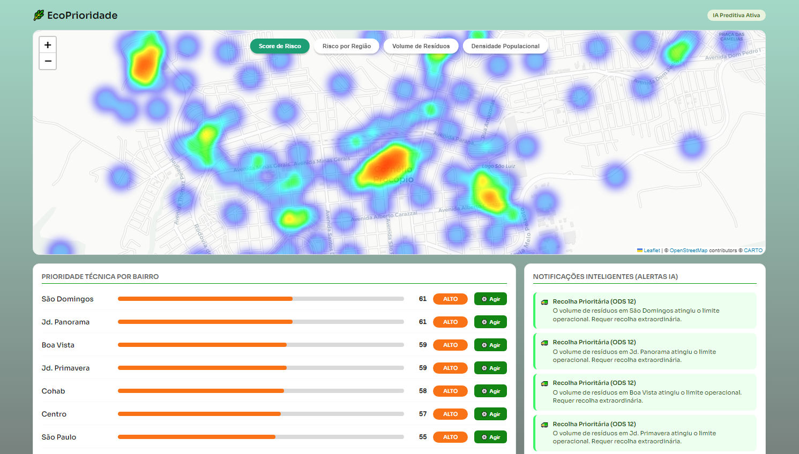
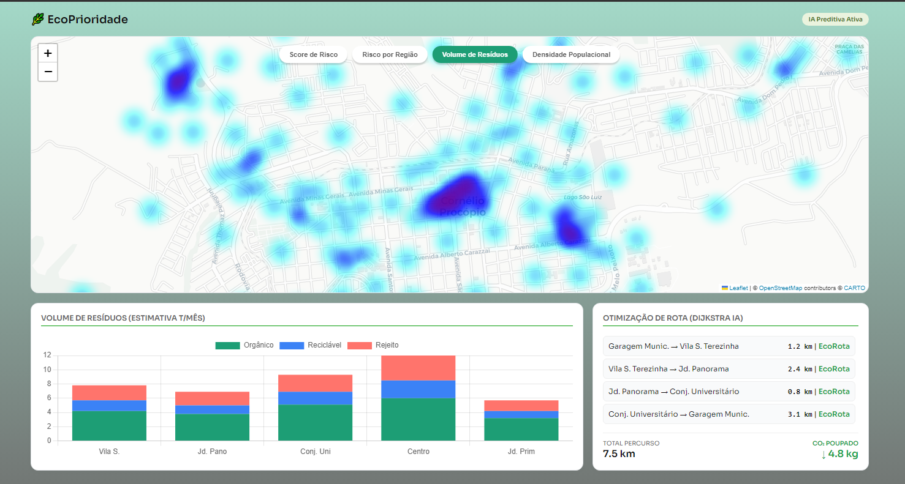
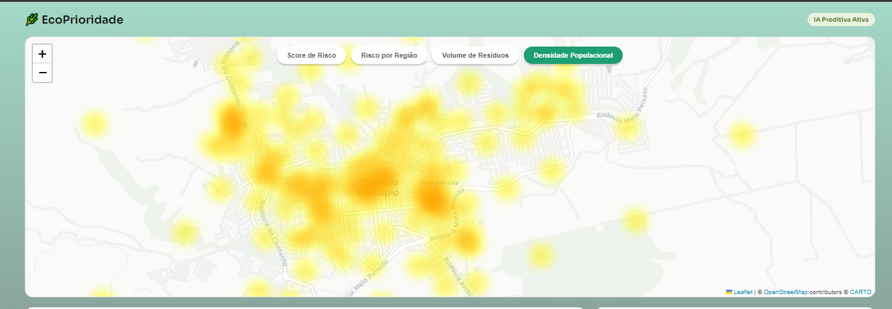

Projeto desenvolvido por 2 dias durante a Competição de Programação:
# 🐝 Hackabee 6.0 - 2026- UTFPR 🐝
### Tema do Hackathon:
Dados e Tecnologias como Ferramentas para Impulsionar a Inovação na Gestão Pública  

# 🧠 EcoPrioridade - Gestão Inteligente de Zeladoria e Resíduos
           

## 📌 Sobre o Projeto

O **EcoPrioridade** é uma plataforma de inteligência urbana desenvolvida para auxiliar a gestão municipal na priorização de ações de zeladoria urbana, coleta de resíduos e prevenção de riscos ambientais.

O sistema utiliza:

- análise espacial
- machine learning
- dados geográficos
- inferência urbana
- logística inteligente

para gerar mapas preventivos e auxiliar a tomada de decisão em tempo real.

## 🎯 Objetivos
- Priorizar regiões urbanas críticas
- Reduzir riscos de alagamento
- Otimizar coleta de resíduos
- Melhorar resposta operacional
- Gerar inteligência urbana preventiva
- Auxiliar planejamento municipal sustentável

## 🏆 Contexto
Projeto desenvolvido para hackathon com foco em:

- cidades inteligentes
- sustentabilidade
- gestão pública
- prevenção urbana
- inteligência operacional

## 🌍 ODS Relacionados
|🏙️ ODS 11 — Cidades e Comunidades Sustentáveis|♻️ ODS 12 — Consumo e Produção Responsáveis|
|-|-|
|**O sistema identifica áreas urbanas vulneráveis considerando:**|**O projeto identifica padrões de geração de resíduos e permite:**|
|relevo|priorização inteligente de coleta|
|drenagem|identificação de regiões críticas|
|descarte irregular|prevenção de descarte irregular
|densidade urbana|suporte à implantação de soluções sustentáveis
|reclamações da população|

## 💼 Modelo de Negócio

<details><summary>Que Problema Ajudamos a Resolver e quais ganhos entregamos?:</summary> 

- De Reativo para Proativo: Antecipação de desastres urbanos (enchentes) através do cruzamento de alertas de chuvas intensas com heatmaps de risco e volume de lixo, prevendo antes que ocorra com utilizando IA para previsão (ou forecasting).
- Redução de Custos com Otimização de rotas de caminhões, economizando combustível e reduzindo a necessidade de horas extras para equipes de manutenção emergencial.
- Empoderamento Político e Orçamentário: Fornecimento de argumentos visuais em dados estatísticos para que o Secretário justifique pedidos de orçamento ao Prefeito.
- Alinhamento ODS: entrega de métricas claras para adequação às metas da Agenda 2030 (ODS 11 e 12), gerando reconhecimento por uma gestão inovadora e tecnológica.

</details>

<details><summary>Como alcançamos nossos segmentos de Clientes?</summary>

- Vendas B2G: participação em processos licitatórios (ou enquadramento no Marco Legal das Startups para contratação de testes de Inovação pelo poder público)
- Eventos e Feiras: apresentações em congressos de municípios (ex: Eventos da CNM) e feiras de Smart Cities.
- Demonstrações Diretas: Reuniões presenciais ou virtuais diretamente com as secretarias alvo, usando o município deles como exemplo no dashboard (prova de conceito rápida)
</details>

<details><summary>Por quais valores nossos clientes estão dispostos a pagar?</summary>

- Assinatura SaaS: cobrança mensal ou anual pelo uso da plataforma (licenciamento de software)
- Taxa de setup/implantação: cobrança unica para configuração inicial, integração das APIs específicas da região e treinamento da equipe operacional reduzida da prefeitura.
</details>
<br>

A solução além de evitar desastres, a solução melhora a saúde pública, garante a mobilidade urbana e aumenta a percepção de segurança e zeladoria pela população, refletindo em aprovação política. 
<br>

**Product Discovery**:
- Mapa de Empatia
- Canvas da Proposta de Valor
- Business Canvas Model

**Cliente Principal**: Prefeituras de pequeno e medio porte (cidades com relevo desafiador e recursos limitados)  

**Usuário Final**: Gestores Municipais (Secretários de Obras, Procuradoria, Planejamento, Meio Ambiente, Serviços Urbanos)

**Beneficiário Indireto**: A população local, que sofre com enchentes e ruas esburacadas, com doenças espalhadas pelo lixo e água acumulada propícia para desenvolvimento de outras doenças.


## 🧠 Principais Funcionalidades

**<details><summary>📍 Mapeamento Urbano Inteligente</summary>**

- Divisão espacial da cidade
- Geração de zonas de influência
- Mapas preventivos
- Heatmaps de criticidade

</details>

**<details><summary> 🌧️ Análise de Risco Ambiental</summary>**

O sistema calcula um Score de Risco/Urgência baseado em:

- volume de resíduos
- índice de chuva
- declividade
- densidade urbana
- reclamações urbanas
- risco de escoamento

</details>


**<details><summary>🤖 Machine Learning para Reclamações</summary>**
Classificação automática de denúncias urbanas utilizando:

- análise textual
- NLP básico
- TF-IDF
- Logistic Regression

O modelo identifica automaticamente se um relato representa:

- descarte irregular
- entupimento
- risco urbano
- reclamação operacional

</details>


**<details><summary>🗺️ Inteligência Espacial</summary>**

- Diagrama Voronoi + Convex Hull
- análise geográfica
- geoprocessamento
- setores censitários
- inferência espacial
- otimização logística

</details>


**<details><summary>🚛 Logística Inteligente</summary>**

O sistema calcula:

- rotas prioritárias
- regiões críticas
- sequência otimizada de atendimento

utilizando conceitos de:

- Dijkstra
- grafos
- otimização operacional

</details>

## 📷 Demonstração
HeatMap - Áreas previstas com maior risco


HeatMap Trash - Áreas com Maior Volumes de Lixo


HeatMap Population Density - Áreas de Maior densidade populacional


## 🧱 Arquitetura do Projeto
```text
                    ┌────────────────────┐
                    │ APIs Públicas      │
                    │                    │
                    │ • Open-Meteo       │
                    │ • IBGE             │
                    │ • OpenStreetMap    │
                    │ • Nominatim        │
                    │ • Overpass API     │
                    └─────────┬──────────┘
                              │
                              ▼
                ┌──────────────────────────┐
                │ Motor Preditivo Python   │
                │                          │
                │ • NLP                    │
                │ • Machine Learning       │
                │ • Spatial Analysis       │
                │ • Voronoi                │
                │ • Cálculo de Score       │
                │ • Logística Inteligente  │
                └─────────┬────────────────┘
                          │
                          ▼
                ┌──────────────────────────┐
                │ FastAPI REST API         │
                │                          │
                │ • Endpoints              │
                │ • Processamento          │
                │ • Integração             │
                └─────────┬────────────────┘
                          │
                          ▼
                ┌──────────────────────────┐
                │ Frontend Interativo      │
                │                          │
                │ • Heatmaps               │
                │ • Dashboard              │
                │ • Mapas Dinâmicos        │
                │ • Gestão Operacional     │
                └──────────────────────────┘
```


🔹 Backend: Python, FastAPI, Uvicorn  
Responsável por: API REST, processamento espacial, cálculo de risco, integração dos dados

🔹 Frontend: HTML, CSS, JavaScript, Leaflet  
Responsável por: renderização do mapa, interação do usuário, visualização dos indicadores

🔹 Dados Espaciais: GeoJSON, OpenStreetMap, setores censitários IBGE, modelos matemáticos

**Arquivos Principais**:
- `index.html`
- `motor_preditivo.py`
- `api_server.py`
<br>

## Desenvolvimento:

**🔂Ingestão de Dados**:  
- Periodicidade da coleta de lixo pelos bairros (seletiva e normal)
- Densidade populacional do município
- Volume de resíduos do município
- Relatos da Ouvidoria do município
- Dados topográficos do município

**➗ Parâmetros dos Cálculos**:  
*Cada bairro é formado pela junção de vários setores*
- Malha do município através de técnicas usando Modelos Matemáticos de Geometria Computacional e Geoprocessamento. 
    - Diagrama de Voronoi e Envoltória Convexa [Convex Hull]
- Periodicidade da coleta de lixo pelos bairros (seletiva e normal)
- Cálculo da Densidade populacional por setor
- Cálculo do Volume de resíduos por setor
- Reclamações da Ouvidoria filtradas por NLP
- Cálculo da Declividade de cada bairro

**🌐 APIs Públicas Utilizadas:**  
*tais quais utilizadas para maior precisão dos cálculos e os fatores variáveis*
- OpenStreetMap / Overpass API (Dados urbanos e infraestrutura viária)
- Open-meteo, INMET, SIMEPAR (meteorologia)
- IBGE e SIDRA IBGE
- Ouvidoria da Plataforma de Transparência de Cornélio Procópio (classificação ML)
- Elevation-API (Declividade de cada bairro)
- OpenStreetMap (reconhecimento das localizações centrais)
- Overpass API (OSM) (buscar infraestrutura)
- Nominatim API (geocodificação de regiões urbanas, endereços -> coordenadas)

**📚 Bibliotecas**:
- geopandas
- pandas
- FastAPI
- folium
- shapely
- numpy
- requests
- leaflet
- Scipy
- OSMnx
- Pydantic
- Uvicorn
- geopy
- scikit-learn

## 🧠 Diferenciais Técnicos
- Inteligência urbana preditiva
- Processamento geoespacial
- Machine learning textual
- Inferência territorial
- Priorização dinâmica
- Integração espacial em tempo real
- Arquitetura híbrida GIS + IA

## 🔮 Evoluções Possíveis
- Integração com sensores IoT urbanos
- Forecasting temporal com séries temporais
- Uso de imagens de satélite
- Visão computacional para descarte irregular
- Integração com drones municipais
- Sistema de alerta preventivo em tempo real
- Dashboard analítico para tomada de decisão
- Integração com Defesa Civil
- Monitoramento de enchentes em tempo real

## Execução:

Com o Docker instalado e aberto digite nesta sequencia:
- `docker compose build`
- `docker compose up -d`

SWAGGER: `http://localhost:8000/docs`  

API: `http://localhost:8000/api/mapa`  

HTML: `http://localhost:8000/static/index.html`  

# 👨‍💻 Equipe
* [Jocimar Borges Júnior](www.github.com/JocimarBJ)
* [Lucas Fares Corrêa Auad Pereira](https://www.linkedin.com/in/lucas-fares-c/)
* [João Pedro Aleksandrov Lorenzetti](https://www.linkedin.com/in/joaopedrolorenzetti/)
* [Eduardo de Oliveira Aguiar](https://www.linkedin.com/in/eduardo-de-oliveira-aguiar-64b838294/)
* [Eric Borges da Costa](https://www.linkedin.com/in/eric-borges-da-costa/)


## Licença
Este projeto está protegido sob licença proprietária personalizada.

O uso comercial, redistribuição, modificação ou apropriação intelectual sem autorização explícita dos autores é proibido.

Confira a Licença do Projeto em [LICENSE](./LICENSE) e os [AUTORES](./AUTHORS.md).